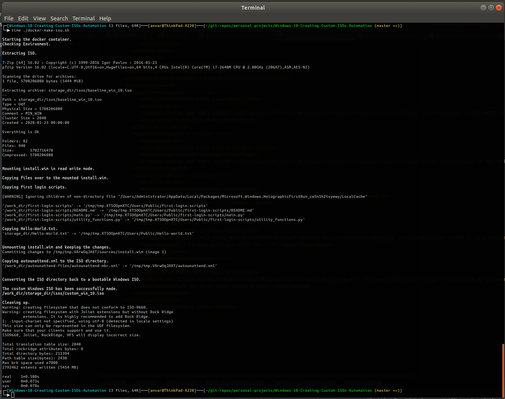
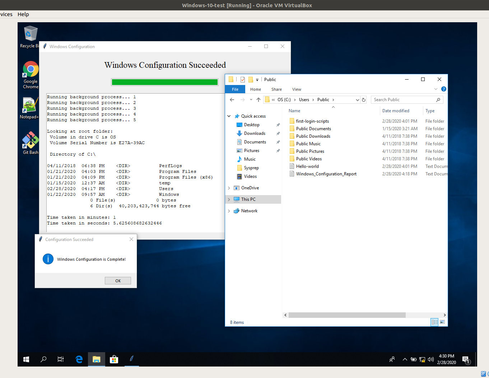
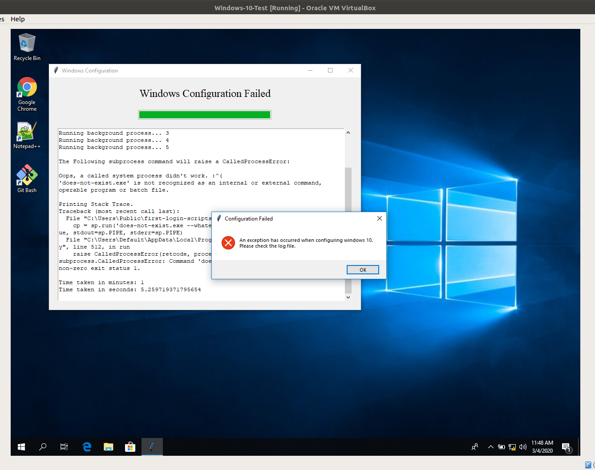

# Windows-10-Creating-Custom-ISOs-Automation
The idea of this repo, is to put this inside of a Continuous Deployment build pipeline for our windows software. My company
wants to have Windows ISOs with our latest software inside of these ISOs ready for clients.


## The Big Picture Process
We pull the latest windows software from git and build them into exes.

We take a baseline windows-10 iso, that has python 3 pre-installed with it.

We load the baseline ISO with the latest exes.

The Windows ISO can be used to create a bootable windows usb, if it needs to installed on a physical machine.

Install Windows with the ISO. The setup is automated with the autounattend.xml. 

Finally, when the Windows machine first boots, it will run a python script, ./first-login-scripts/main.py, that will configure the system and install those exes.


## The Process of Making Custom ISOs

The ./main.py script automates making custom Windows ISOs. It does the following steps to reach that goal:

1. Extract a Windows 10 ISO with 7z to a directory.
2. Mount the install.wim file on a directory with wimtools.
3. Copy over the files you want to the mounted install.wim.
4. Unmount the install.wim and commit the changes you made.
5. Copy over an autounattend.xml to the root of the iso directory.
5. Convert the files you extracted with 7z back to a bootable ISO with genisoimage.

Now you have a custom Windows 10 ISO with the files you want loaded on and an autounattend.xml.

Currently, it just copies over the ./fist-loging-scripts/ directory, and ./storage_dir/Hello-World.txt as a dummy example. 





## First Boot Python Script
When the Windows fist boots, it will run a Python script. 

This is because the autounattend.xml has the tag, \<CommandLine\>"C:\Users\default\AppData\Local\Programs\Python\Python38\pythonw.exe" "C:\Users\Public\first-login-scripts\main.py"\</CommandLine\>.

This python script will configure the system and install the installer exes loaded on to the iso. The installer exes are made with Inno Setup, so they can be installed with the command line.

I also made a tkinter GUI that will provide output to tell the user if python script succeed or failed.
Currently, it only runs a dummy example, and doesn't configure the system or install any software.

Below are examples of a successful and a failed Windows configuration.

####Success:


####Failure:


## Running the scripts
This script was meant to run on a linux system, with Python 3.8.1 or higher, wimtools, mkisofs, and 7z.
Since there are quite a few dependencies, I made a Dockerfile for Ubuntu 18.04 that has all the required dependencies.

First build the Docker image.
```
docker build -t ubuntu_py_win_dep:18.04 ./
```

Then run the bash script, ./docker-make-iso.sh, to make the custom Windows ISO.
```
./docker-make-iso.sh
```
This will use the baseline ISO from ./storage_dir/isos/baseline_win_10.iso and make ./storage_dir/isos/custom_win_10.iso.

You can change the default ISO names and make the autounattend.xml install Windows for UEFI systems with the -u argument.
Use the -h option for help.

Then run the bash script, ./docker-make-usb.sh, to make a bootable Windows USB. 
```
./docker-make-usb.sh
```
This will automatically find a USB storage device, and turn that USB into a Windows installer with the ISO ./storage_dir/isos/custom_win_10.iso.

The docker image uses WoeUSB for the job.
This of course destroys all data on that USB storage device. 
You may add an argument to choose a different Windows ISO.
